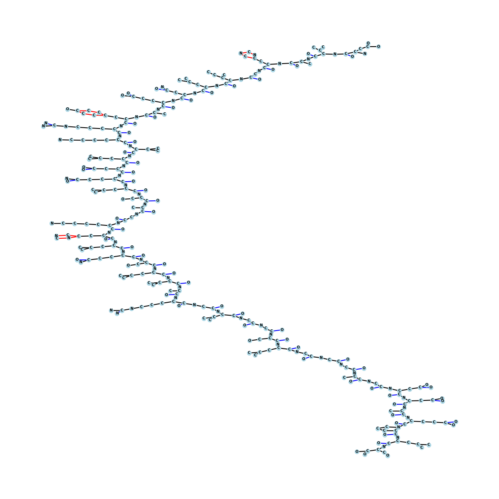
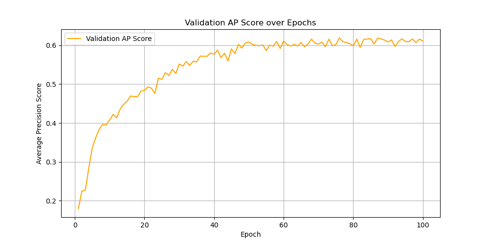
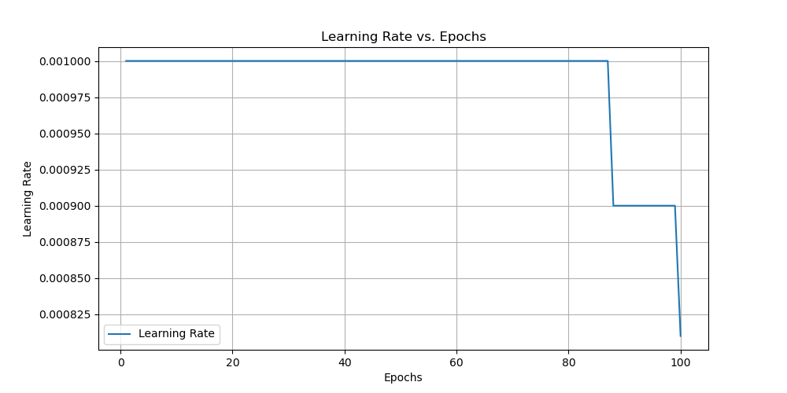

# Graph Machine Learning - Exercise 3

**By Group 06**

## Objective

The aim of this exercise is to implement a Graph Neural Network (GNN) with advanced components like virtual nodes and the GINE layer for multi-label classification on the **Peptides-func dataset**. The exercise also involves visualizing molecular graphs to better understand the dataset.

## Methodology

### Dataset Overview

- **Peptides-func Dataset**: Contains molecular graphs where:
  - Nodes represent atoms.
  - Edges represent bonds with additional attributes, such as bond types.
  - Labels are multi-dimensional, representing molecular properties. The task is a multi-label classification problem.

### Model Architecture

1. **GINE Layer with Virtual Nodes**:
   - Implements the **Graph Isomorphism Network (GIN)** with enhanced edge handling and virtual node embeddings.
   - Encodes node and edge features and uses `torch_scatter` for efficient aggregation of messages from neighboring nodes.

2. **GNN with Virtual Nodes**:
   - Combines multiple GINE layers with a virtual node to enable global context sharing during each message-passing step.

3. **Global Mean Pooling**:
   - Aggregates node-level features into a graph-level embedding for prediction.

4. **Readout Layer**:
   - A fully connected layer converts graph-level embeddings into predictions for multi-label classification.

### Training Process

1. **Data Preparation**:
   - The dataset is split into train, validation, and test sets using PyTorch Geometric.

2. **Training Loop**:
   - The model is trained using **Binary Cross-Entropy Loss with Logits** and optimized with **AdamW**.
   - A learning rate scheduler adjusts the learning rate based on validation performance.

3. **Evaluation**:
   - Validation and test performance is measured using **Average Precision (AP)** scores per class.

4. **Visualization**:
   - Metrics such as training loss, validation AP scores, and learning rates are plotted.
   - Molecule visualization highlights atom types and bond types, aiding in dataset interpretation.

### Visualization: Molecule Graphs

The molecule visualization uses NetworkX to generate a graph layout where:
- **Nodes** represent atoms with different colors and labels corresponding to their atomic types (e.g., Carbon, Oxygen, Nitrogen).
- **Edges** represent bonds, colored by bond type (e.g., single, double, or triple bonds).

#### Key Insights:
- **Graph Layout**: Uses the Kamada-Kawai algorithm for clear positioning of nodes and edges.
- **Bond Representation**: Bond types (e.g., single, double, triple or rare) are depicted using different edge colors for intuitive understanding.
- **Atom Labels**: Atom types are annotated directly on the graph for interpretability.

#### Example:
The visualization of `peptides_train[0]`, in the figure below, provides a detailed molecular graph:
- **Nodes**: Represent atoms with labels such as "C" (Carbon), "N" (Nitrogen), and "O" (Oxygen).
- **Edges**: Represent chemical bonds, color-coded as:
  
  - **Black**: Single bonds
  
  - **Blue**: Double bonds
  
  - **Red**: Triple bonds or rare bond types.

- **Structure**: The graph forms a branched molecular structure, resembling the hierarchical relationships in complex molecules. 

### Results
- **Validation AP Score**: The model achieves a validation AP score of ~0.6160 after 100 epochs.
- **Test AP Score**: The test AP score is ~0.6022, demonstrating effective generalization.

### Graph Interpretations

1. **Training Loss vs. Epochs**:
   - Shows a consistent decrease, reflecting effective optimization.
   
   

2. **Validation AP Score vs. Epochs**:
   - Shows gradual improvement, peaking at epoch 70 before stabilizing.
   
   

3. **Learning Rate vs. Epochs**:
   - Learning rate dynamically decreases after epoch 87, aiding convergence in the later stages of training.
   
   