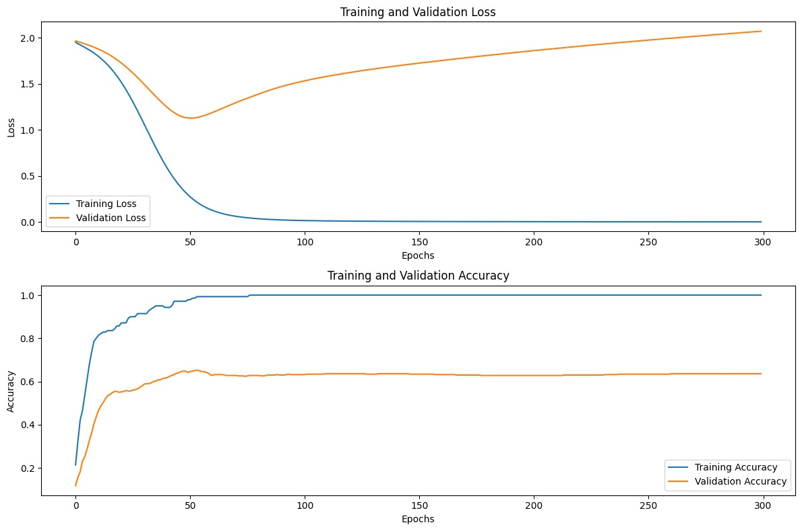
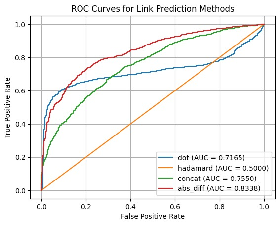

# Node2Vec Implementation and Evaluation

This project implements and evaluates the **Node2Vec** algorithm for graph embedding using the **Cora** dataset. The primary objectives include:

1. Sampling **pq-walks** for nodes.
2. Implementing the Node2Vec embedding model and its training.
3. Evaluating the performance of the embeddings for:
    - **Node Classification**
    - **Link Prediction** (on both **Cora** and **PPI** datasets).

---

## Table of Contents
1. [Implementation Details](#implementation-details)
2. [Evaluation Results](#evaluation-results)
    - [Node Classification](#node-classification)
    - [Link Prediction](#link-prediction)

---

## Implementation Details

### 1. PQ-Walks Dataset
We implemented a custom sampler using **torch_cluster**'s `random_walk` utility to generate **pq-walks**:
- **p (Return parameter)** and **q (In-out parameter)** control the biases of the walks.
- The walks are stored in a dataset for efficient batch processing during training.

### 2. Node2Vec Model and Training
The Node2Vec model:
- Uses a `torch.nn.Embedding` layer to learn embeddings for nodes in the graph.
- Optimized using **negative sampling loss**, combining positive and negative node pairs.

### 3. Node Classification
- Embeddings generated by Node2Vec are fed into a small **MLP classifier** for node classification.
- Classification performance is measured using accuracy on the **Cora** dataset.

### 4. Link Prediction
- For link prediction, embeddings of two nodes are combined using methods such as:
    - **Dot Product**
    - **Hadamard Product**
    - **Concatenation**
    - **Absolute Difference**
- Performance is evaluated using:
    - **ROC AUC (Receiver Operating Characteristic - Area Under Curve)**
    - **AP (Average Precision)**

---

## Evaluation Results

### Node Classification

| Metric       | Train Accuracy | Validation Accuracy | Test Accuracy |
|--------------|----------------|---------------------|---------------|
| **Accuracy** | 100.0%         | 64.7%               | 64.7%         |

#### Classification Report (Test Set)
| Class | Precision | Recall  | F1-Score | Support |
|-------|-----------|---------|----------|---------|
| 0     | 0.5168    | 0.5923  | 0.5520   | 130     |
| 1     | 0.5827    | 0.8132  | 0.6789   | 91      |
| 2     | 0.7597    | 0.8125  | 0.7852   | 144     |
| 3     | 0.7670    | 0.4953  | 0.6019   | 319     |
| 4     | 0.5822    | 0.5705  | 0.5763   | 149     |
| 5     | 0.6748    | 0.8058  | 0.7345   | 103     |
| 6     | 0.5579    | 0.8281  | 0.6667   | 64      |

- **Macro Average**:
    - Precision: **0.6344**
    - Recall: **0.7025**
    - F1-Score: **0.6565**
- **Weighted Average**:
    - Precision: **0.6662**
    - Recall: **0.6470**
    - F1-Score: **0.6428**

---

### Training and Validation Metrics
Below are the training and validation loss and accuracy graphs for Node2Vec:

#### Training and Validation Loss

---

### Link Prediction (Cora)

#### Methods and Results

| Combination Method     | ROC AUC | AP Score |
|------------------------|---------|----------|
| **Dot Product**        | 0.7165  | 0.7890   |
| **Hadamard Product**   | 0.5000  | 0.5000   |
| **Concatenation**      | 0.7550  | 0.7693   |
| **Absolute Difference**| 0.8338  | 0.8483   |

#### Observations:
- **Absolute Difference** performed the best with a **ROC AUC of 0.8338** and an **AP score of 0.8483**.
- **Concatenation** and **Dot Product** also provided strong results, with ROC AUC scores of **0.7550** and **0.7165**, respectively.
- **Hadamard Product** did not perform better than random guessing, yielding a ROC AUC of **0.5000**.

---

### Visualizing Link Prediction Performance
Below is the visualization of the ROC curves for different combination methods:

