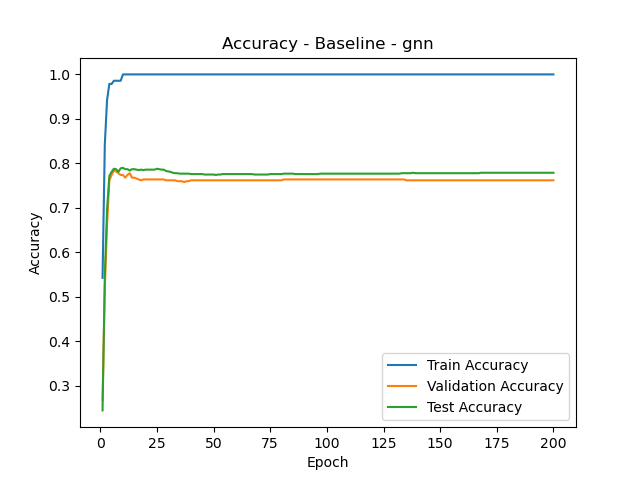
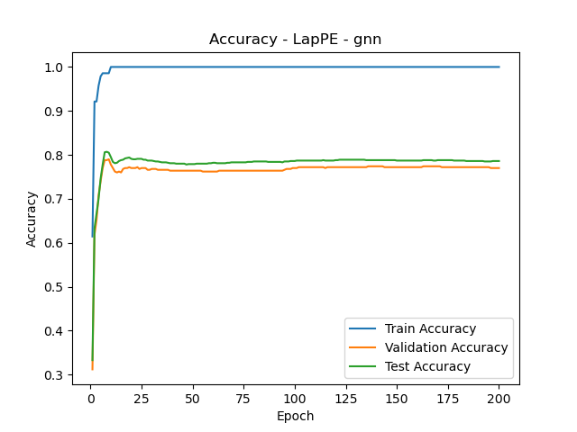
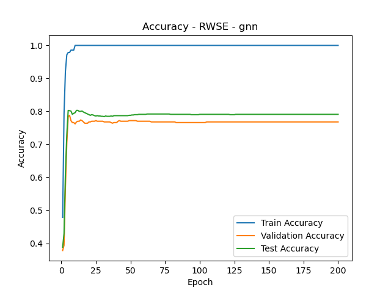
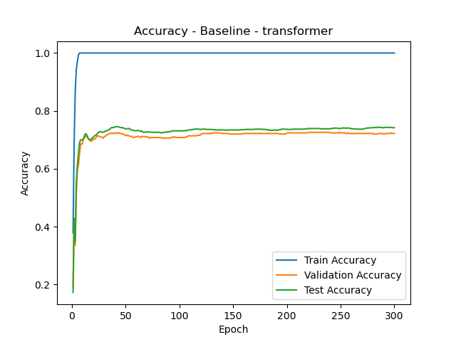

# Implementation and evaluation of Graph Transformers with different positional encodings

This projects focuses on testing a graph transformer model on the Cora and the Peptides-func datasets. We will use laplatian positional encodings and random walk structural embeddings to capture the edge distribution of the graphs.

---

## Table of Contents
1. [Overview](#overview)
2. [Prerequisites](#prerequisites)
3. [Tasks Overview](#tasks-overview)
    - [Task 1: Laplacian Positional Encodings (LapPE)](#task-1-laplacian-positional-encodings-lappe)
    - [Task 2: Combining LapPE with SignNet](#task-2-combining-lappe-with-signnet)
    - [Task 3: Random Walk Structural Embeddings (RWSE)](#task-3-random-walk-structural-embeddings-rwse)
    - [Task 4: Pure Graph Transformer](#task-4-pure-graph-transformer)
    - [Task 5: Performance Comparison of LapPE and RWSE](#task-5-performance-comparison-of-lappe-and-rwse)
4. [Datasets](#datasets)
5. [Usage](#usage)
6. [Results and Observations](#results-and-observations)
7. [References](#references)

---

## Tasks Overview

### Task 1: Laplacian Positional Encodings (LapPE)
- **Goal**: Compute Laplacian eigenvectors for a graph using the Laplacian matrix \( L = D - A \).
- **Steps**:
  1. Define a `compute_lap_pe()` function for calculating LapPE.
  2. Test the function on a custom dataset.
- **Outputs**: Laplacian positional encodings for the nodes in the graph.

---

### Task 2: Combining LapPE with SignNet
- **Goal**: Make LapPE embeddings sign-invariant using a SignNet-based model.
- **Steps**:
  1. Define a `SignNet` class and the `compute_lap_pe_with_signnet()` function.
  2. Test the implementation on a custom graph.
- **Outputs**: Sign-invariant Laplacian positional encodings.

---

### Task 3: Random Walk Structural Embeddings (RWSE)
- **Goal**: Compute RWSE by counting closed walks of a given length \( k \) in a graph.
- **Steps**:
  1. Define the `compute_rwse()` function.
  2. Test it using the *KarateClub* dataset from `torch_geometric.datasets`.
- **Outputs**: Structural embeddings capturing node-level random walk statistics.

---

### Task 4: Pure Graph Transformer
- **Goal**: Implement a graph transformer model to process graphs using global attention.
- **Steps**:
  1. Define a `GraphTransformer` class with a `GraphTransformerEncoderLayer`.
  2. Implement a `GCN` class for baseline comparison.
  3. Define training, testing, and evaluation functions.
  4. Test the model on the *Cora* dataset, recording:
      - Training loss and accuracy
      - Validation accuracy
      - Test accuracy for each epoch
- **Outputs**: A trained graph transformer with accuracy metrics.

---

### Task 5: Performance Comparison of LapPE and RWSE
- **Goal**: Compare the impact of LapPE and RWSE embeddings on model performance.
- **Steps**:
  1. Define a `run_experiments()` function to test various configurations:
      - Baseline (no embeddings)
      - LapPE only
      - RWSE only
      - LapPE + RWSE
  2. Measure performance for each configuration using the metrics from Task 4.
- **Outputs**: Comparative results showcasing the effectiveness of different embeddings.

# Evaluation Results

## Task 4: Model Evaluation

The results of Task 4 are summarized below, showing the performance metrics across different epochs:

### Performance Metrics Across Selected Epochs:

| Epoch | Loss   | Train Accuracy | Validation Accuracy | Test Accuracy |
|-------|--------|----------------|----------------------|---------------|
| 10    | 0.0752 | 1.0000         | 0.6780              | 0.6670        |
| 50    | 0.0036 | 1.0000         | 0.7140              | 0.7170        |
| 100   | 0.0018 | 1.0000         | 0.7120              | 0.7130        |
| 200   | 0.0007 | 1.0000         | 0.7080              | 0.7080        |
| 300   | 0.0005 | 1.0000         | 0.7040              | 0.7020        |
| 400   | 0.0004 | 1.0000         | 0.7060              | 0.7070        |

The model achieved its best performance at epoch **50**, with a validation accuracy of **0.7140** and a test accuracy of **0.7170**.

---

## Task 5: Model Comparison

The results of Task 5 compare the performance of the GNN (Graph Neural Network) and Transformer-based models under different configurations. The metrics are summarized below:

### GNN Results
#### Baseline
| Epoch | Loss   | Train Accuracy | Validation Accuracy | Test Accuracy |
|-------|--------|----------------|----------------------|---------------|
| 20    | 0.0034 | 1.0000         | 0.7640              | 0.7860        |
| 60    | 0.0001 | 1.0000         | 0.7640              | 0.7870        |
| 200   | 0.0001 | 1.0000         | 0.7640              | 0.7860        |

#### LapPE
| Epoch | Loss   | Train Accuracy | Validation Accuracy | Test Accuracy |
|-------|--------|----------------|----------------------|---------------|
| 20    | 0.0038 | 1.0000         | 0.7680              | 0.7790        |
| 60    | 0.0001 | 1.0000         | 0.7640              | 0.7800        |
| 200   | 0.0000 | 1.0000         | 0.7680              | 0.7730        |

#### RWSE
| Epoch | Loss   | Train Accuracy | Validation Accuracy | Test Accuracy |
|-------|--------|----------------|----------------------|---------------|
| 20    | 0.0114 | 1.0000         | 0.7700              | 0.7940        |
| 60    | 0.0002 | 1.0000         | 0.7620              | 0.7900        |
| 200   | 0.0001 | 1.0000         | 0.7660              | 0.7930        |

### Transformer Results
#### Baseline
| Epoch | Loss   | Train Accuracy | Validation Accuracy | Test Accuracy |
|-------|--------|----------------|----------------------|---------------|
| 20    | 0.0259 | 1.0000         | 0.6800              | 0.6720        |
| 100   | 0.0010 | 1.0000         | 0.7040              | 0.6930        |
| 500   | 0.0002 | 1.0000         | 0.7140              | 0.7050        |

#### LapPE
| Epoch | Loss   | Train Accuracy | Validation Accuracy | Test Accuracy |
|-------|--------|----------------|----------------------|---------------|
| 20    | 0.0201 | 1.0000         | 0.6980              | 0.7060        |
| 200   | 0.0006 | 1.0000         | 0.7180              | 0.7320        |
| 500   | 0.0001 | 1.0000         | 0.7320              | 0.7380        |

### Best Performances
- **GNN RWSE**: Test Accuracy = **0.7950** at epoch 160.
- **Transformer LapPE**: Test Accuracy = **0.7380** at epoch 500.

---
